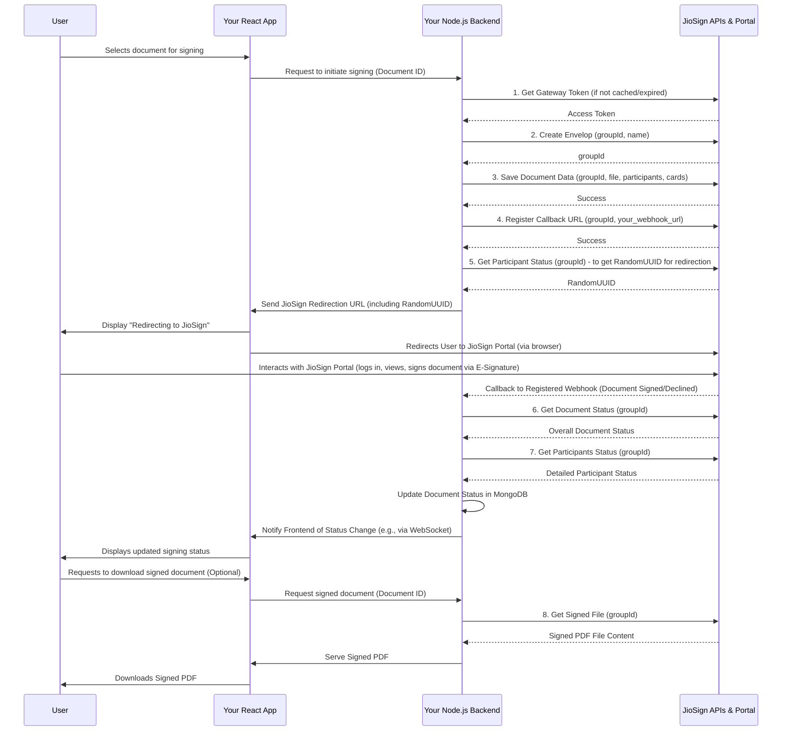

```mermaid
sequenceDiagram
participant User
participant Frontend as Your React App
participant Backend as Your Node.js Backend
participant JioSign as JioSign APIs & Portal

    User->>Frontend: Selects document for signing
    Frontend->>Backend: Request to initiate signing (Document ID)

    Backend->>JioSign: 1. Get Gateway Token (if not cached/expired)
    JioSign-->>Backend: Access Token

    Backend->>JioSign: 2. Create Envelop (groupId, name)
    JioSign-->>Backend: groupId

    Backend->>JioSign: 3. Save Document Data (groupId, file, participants, cards)
    JioSign-->>Backend: Success

    Backend->>JioSign: 4. Register Callback URL (groupId, your_webhook_url)
    JioSign-->>Backend: Success

    Backend->>JioSign: 5. Get Participant Status (groupId) - to get RandomUUID for redirection
    JioSign-->>Backend: RandomUUID

    Backend->>Frontend: Send JioSign Redirection URL (including RandomUUID)

    Frontend->>User: Display "Redirecting to JioSign"
    Frontend->>JioSign: Redirects User to JioSign Portal (via browser)

    User->>JioSign: Interacts with JioSign Portal (logs in, views, signs document via E-Signature)

    JioSign-->>Backend: Callback to Registered Webhook (Document Signed/Declined)

    Backend->>JioSign: 6. Get Document Status (groupId)
    JioSign-->>Backend: Overall Document Status

    Backend->>JioSign: 7. Get Participants Status (groupId)
    JioSign-->>Backend: Detailed Participant Status

    Backend->>Backend: Update Document Status in MongoDB

    Backend->>Frontend: Notify Frontend of Status Change (e.g., via WebSocket)
    Frontend->>User: Displays updated signing status

    User->>Frontend: Requests to download signed document (Optional)
    Frontend->>Backend: Request signed document (Document ID)
    Backend->>JioSign: 8. Get Signed File (groupId)
    JioSign-->>Backend: Signed PDF File Content
    Backend->>Frontend: Serve Signed PDF
    Frontend->>User: Downloads Signed PDF
```
