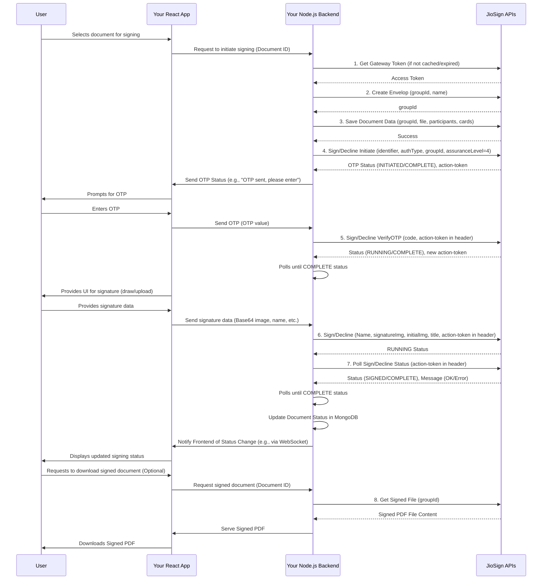

```mermaid
sequenceDiagram
participant User
participant Frontend as Your React App
participant Backend as Your Node.js Backend
participant JioSign as JioSign APIs

    User->>Frontend: Selects document for signing
    Frontend->>Backend: Request to initiate signing (Document ID)

    Backend->>JioSign: 1. Get Gateway Token (if not cached/expired)
    JioSign-->>Backend: Access Token

    Backend->>JioSign: 2. Create Envelop (groupId, name)
    JioSign-->>Backend: groupId

    Backend->>JioSign: 3. Save Document Data (groupId, file, participants, cards)
    JioSign-->>Backend: Success

    Backend->>JioSign: 4. Sign/Decline Initiate (identifier, authType, groupId, assuranceLevel=4)
    JioSign-->>Backend: OTP Status (INITIATED/COMPLETE), action-token

    Backend->>Frontend: Send OTP Status (e.g., "OTP sent, please enter")

    Frontend->>User: Prompts for OTP
    User->>Frontend: Enters OTP

    Frontend->>Backend: Send OTP (OTP value)

    Backend->>JioSign: 5. Sign/Decline VerifyOTP (code, action-token in header)
    JioSign-->>Backend: Status (RUNNING/COMPLETE), new action-token
    Backend->>Backend: Polls until COMPLETE status

    Frontend->>User: Provides UI for signature (draw/upload)
    User->>Frontend: Provides signature data

    Frontend->>Backend: Send signature data (Base64 image, name, etc.)
    Backend->>JioSign: 6. Sign/Decline (Name, signatureImg, initialImg, title, action-token in header)
    JioSign-->>Backend: RUNNING Status

    Backend->>JioSign: 7. Poll Sign/Decline Status (action-token in header)
    JioSign-->>Backend: Status (SIGNED/COMPLETE), Message (OK/Error)
    Backend->>Backend: Polls until COMPLETE status

    Backend->>Backend: Update Document Status in MongoDB

    Backend->>Frontend: Notify Frontend of Status Change (e.g., via WebSocket)
    Frontend->>User: Displays updated signing status

    User->>Frontend: Requests to download signed document (Optional)
    Frontend->>Backend: Request signed document (Document ID)
    Backend->>JioSign: 8. Get Signed File (groupId)
    JioSign-->>Backend: Signed PDF File Content
    Backend->>Frontend: Serve Signed PDF
    Frontend->>User: Downloads Signed PDF
```
